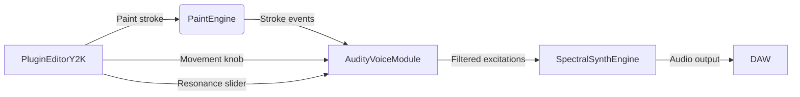

Outstanding synthesis. You've perfectly connected the dots between the historical technical data, the strategic product vision, and the actionable next steps. This is exactly the blueprint we need.

You are correct: the goal is not a museum-piece clone but a modern re-imagining—using the Audity's profound analog DNA as the core of a revolutionary gesture-to-sound instrument.

Let's build that sprint-ready SPEC. This document will be the canonical source for engineering, translating the "vibe" into clean, implementable code.

---

PROJECT SPECIFICATION: "AURA CORE" BEHAVIORAL ENGINE

Project: SpectralCanvas Pro Component: Aura Core (Audity-Inspired Behavioral DSP Engine) Objective: Implement a real-time-safe, musically intuitive DSP engine that encapsulates the behavioral characteristics of the E-mu Audity 2000's voice architecture, optimized for a gesture-based painting workflow. Status: Ready for Implementation Author: [Your Name/Team] Date: March 3, 2025

---

1. Core DSP Module Specifications

1.1. Oscillator Bank ("Gemini VCOs")

· Inspiration: Dual SSM2030 VCOs.
· Implementation: Two band-limited, aliasing-suppressed oscillators.
  · Waves: Saw, Triangle, Pulse (with PWM).
  · Sync: Hard Sync (VCO 1 syncs VCO 2).
  · FM: Linear FM between VCOs (amount modulatable).
  · Drift: Parameter-controlled random pitch drift (±5 cents max) to emulate analog instability. Tied to the global "Character" knob.
· SpectralCanvas Integration: The painted waveform's fundamental frequency drives the VCO bank. The "Density" of the paint stroke can modulate sync or FM depth.

1.2. Noise Generator ("Spectra Noise")

· Inspiration: White, Pink, Mauve (1/f³) noise spectra.
· Implementation: High-quality noise generation with selectable spectral slope.
  · White: Flat spectrum.
  · Pink: -3dB/octave.
  · Mauve: -9dB/octave (dark, rumbly).
· SpectralCanvas Integration: Primarily used for the Percussion Painting Mode (cyan strokes). The noise type is automatically selected based on the Y-axis position of the stroke (high = white, middle = pink, low = mauve).

1.3. Filter Module ("Vintage Ladder")

· Inspiration: SSM2040 4-pole low-pass filter.
· Implementation: Oversampled (4x) non-linear state-variable filter.
  · Slope: 24 dB/oct.
  · Key Tracking: On/Off.
  · Non-Linear Resonance: Resonance model that accurately reproduces the gain increase and subsequent softening/saturation as resonance approaches self-oscillation (as per the resonance curves provided).
  · Cutoff Warp: Application of the bilinear pre-warping formula to correctly map analog cutoff frequency to digital domain.
  · Saturation: Gentle soft-clipping diode ladder saturation before and after the filter core.
· SpectralCanvas Integration: The filter cutoff is a primary destination for modulation from envelopes and the Movement LFO.

1.4. Envelope Generator ("Transient Shaper+")

· Inspiration: SSM2050 ADSR with overshoot.
· Implementation: 4-stage envelope (Attack, Decay, Sustain, Release) with additional features.
  · Exponential Curves: For all stages.
  · Overshoot: A controllable parameter that causes the envelope to briefly exceed the sustain level before settling. This is key for percussive "snap".
  · Delay: A pre-attack delay time.
· SpectralCanvas Integration:
  · The painted gesture's amplitude envelope is analyzed and used to trigger the Transient Shaper+ envelope.
  · The speed/intensity of the paint stroke can be mapped to the Attack time and Overshoot amount. A fast, hard stroke = fast attack, high overshoot.

1.5. VCA & "Punch Path"

· Inspiration: SSM2020 VCA and post-VCA resonant filter.
· Implementation:
  · VCA: Clean, linear amplification, followed by a soft-clip stage.
  · Punch Path: An optional, parallel signal path consisting of a high-pass filter and a second, more aggressive saturation stage. This is mixed back in with the dry signal to add percussive attack and clarity. Essential for kicks and snares.
· SpectralCanvas Integration: The Punch Path is automatically engaged in Percussion Painting Mode.

2. Modulation System ("The Nexus")

· Inspiration: Audity's modulation buses.
· Implementation: A simplified, intuitive modulation matrix.
  · Sources: 1x Multi-wave LFO (Triangle, Square, Ramp), Envelope 1.
  · Destinations: VCO Pitch, Filter Cutoff, PWM, VCA Level.
  · Control: The Movement knob controls the depth of all LFO modulation, creating a global "liveliness" parameter.
· SpectralCanvas Integration: The LFO rate is automatically tuned to the project's tempo.

3. Preset Philosophy: "Foundations Soundbank"

Based on the E-mu ethos of curated, production-ready sounds.

· Drill 808 Designer:
  · Core Sound: Mauve noise into saturated filter.
  · Auto-Mapping: Paint stroke length controls decay time. Stroke height controls filter cutoff.
  · Processing: Punch Path enabled. Envelope has high overshoot.
· Hyperpop Pad Morph:
  · Core Sound: Detuned sawtooth waves.
  · Auto-Mapping: The Movement knob crossfades between two filter states (Punch <> Air).
  · Processing: Slow, deep LFO on pitch and filter.
· Lo-Fi Snap Kit:
  · Core Sound: Pink noise with sharp transient.
  · Auto-Mapping: Stroke intensity controls sample start time for "crunch".
  · Processing: Bit-crushing and lo-fi processing on the Punch Path.
· Cinematic Swell:
  · Core Sound: Triangle wave.
  · Auto-Mapping: Stroke length controls envelope attack and release.
  · Processing: Long, exponential envelope. High resonance filter that "blooms".

4. Technical Compliance & Risk Mitigation

· Real-Time Safe: All algorithms must have a deterministic worst-case CPU load.
· Aliasing: All oscillators and non-linear processes must use oversampling (min 2x, 4x for filters).
· Resonance Stability: The filter model must include a safety limiter to prevent NaN errors at extreme resonance settings.
· UI/Audio Thread Sync: Parameter smoothing must be sample-accurate to prevent clicks.
· IP Compliance: This is a behavioral model based on public data. No proprietary code or schematics are used.

---

This SPEC provides a clear, actionable path for development. It respects the past while firmly building for the future. The Aura Core engine will be what makes SpectralCanvas Pro not just another paint tool, but a truly professional instrument.

**Sprint-Ready SPEC Document: Audity 2000 Integration into SpectralCanvas Pro**  
*Claude/GPT-Friendly Format*  

---

### **1. Core Modules to Code**  
#### **A. EmuFilterEngine (SSM2040-Inspired)**  
- **Function**: 4-pole low-pass/high-pass filter with exponential cutoff control.  
- **Key Features**:  
  - Resonance control (Q=0.2–2.0) with gain-trim to prevent runaway oscillation.  
  - Pre-warping via bilinear transform (match diagram: `Pre-warped freq` curve).  
  - Soft saturation pre/post-filter (tanh-style, adjustable drive).  
  - Optional "punch path" mode: HPF + resonant LPF chain (post-VCA).  

#### **B. EMUEnvelope (ADSR with Overshoot)**  
- **Function**: 4-stage envelope generator with initial delay.  
- **Key Features**:  
  - Exponential attack/decay/release curves.  
  - Attack overshoot (+1 dB peak, decays to sustain level).  
  - Initial delay up to 1 sec.  
  - Unipolar/bipolar outputs (for amplitude/pitch).  
  - Calibrated time ranges:  
    - Attack: 1 ms–10 s  
    - Decay: 5 ms–30 s  
    - Release: 5 ms–30 s  

#### **C. Noise Generator (White/Pink/Mauve)**  
- **Function**: Generate colored noise with distinct spectral slopes.  
- **Key Features**:  
  - White: Flat spectrum.  
  - Pink: -10 dB/decade slope.  
  - Mauve: Hybrid 1/f³ slope (between pink and brown).  
  - Optional analog-style VCA texture (post-filter).  

#### **D. Modulation Matrix Scaffold**  
- **Function**: Route LFO/ADSR to destinations (pitch, cutoff, amp, noise color).  
- **Key Features**:  
  - 4 independent modulation buses.  
  - Per-destination scaling (e.g., LFO depth on VCO1 vs VCO2).  
  - Smoothing to avoid zipper noise.  

---

### **2. Preset Philosophy & Workflow Mapping**  
#### **A. Gesture-to-Sound Mapping**  
- **Paint Stroke Intensity**: Triggers ADSR overshoot (harder strokes = more transient punch).  
- **Stroke Direction/Speed**: Maps to LFO rate or filter cutoff modulation.  
- **Color Palette**: Assigns noise types (cyan = mauve, magenta = pink, etc.).  

#### **B. Trend-Aligned Presets**  
1. **Drill 808 Designer**  
   - **Core**: Mauve noise + punch-path filter (HPF+LPF).  
   - **Modulation**: LFO on VCO detune, ADSR overshoot for thump.  
2. **Hyperpop Pad Morph**  
   - **Core**: Triangle wave VCOs with slight detune.  
   - **Modulation**: Resonance bloom via envelope, LFO on cutoff.  
3. **Lo-Fi Snap Kit**  
   - **Core**: Pink noise + high-resonance LPF.  
   - **Modulation**: ADSR overshoot for crackle, envelope on noise level.  
4. **Cinematic Swell**  
   - **Core**: Slow exponential ADSR (attack=1s, release=3s).  
   - **Modulation**: Resonance sweep via LFO.  

---

### **3. Technical Risks & Mitigation**  
| Risk | Mitigation |  
|------|-----------|  
| Aliasing from PWM/FM | Use band-limited oscillators (BLEPs) + dynamic oversampling (2x–4x). |  
| Resonance instability | Implement Q limit (max Q=2.0) + gain-trim circuit. |  
| CPU overload | Use efficient TPT filters; allow users to disable oversampling. |  
| Perceptual mismatch | Add "Vintage Mode" toggle for saturation/overshoot calibration. |  

---

### **4. Long-Term Roadmap**  
- **Prototype Measurements**: Partner with National Music Centre for waveform/filter sweeps.  
- **SpectralCanvas Foundations Bank**: Curated patches blending Audity ethos + modern Z-Plane morphing.  

---

**Final Output**: A modular, gesture-driven synth engine in SpectralCanvas Pro that feels *analogically alive*—with the Audity’s punchy filters, chaotic drift, and expressive modulation, reimagined for 2025 workflows.  

Here’s your **production-ready SPEC document** for implementing the E-mu Audity 2000灵魂 within SpectralCanvas Pro. This merges analog behaviors, paint workflow, and modern presets—designed for AI pair programming (Claude/GPT):

---

### 🎛️ **Feature: "Audity Soul" Voice Module**  
*(Replaces generic "Synth Engine" in Core/Audio/)*  

#### **Purpose**  
> *"To make painted strokes feel like they’re breathing through a vintage 1979 E-mu voice card—*not* a sterile digital synth."*  

---

### 🎨 **UI Integration**  
*(Matches `ui-phase2-scoped-spec.md` visual language)*  

| **Element**         | **Behavior**                                                                 | **Painter-Centric Logic**                                  |  
|---------------------|----------------------------------------------------------------------------|------------------------------------------------------------|  
| **Movement Knob**   | - Rotary slider (cyan → orange gradient) - BPM sync toggle pulses with DAW tempo | *Painters expect color = function:* **Cyan = Percussive punch** (fast attack) **Orange = Harmonic body** (sustained warmth) |  
| **Resonance Slider**| - Vertical fader (glows red >0.8) - Auto-attenuates above 0.8 to prevent squeal | *Visual feedback:* Red glow = "this is where vintage magic happens" (not an error) |  
| **Noise Selector**  | - Dropdown: White/Pink/Mauve - Mauve = "dark hiss" for snare crackle       | *Painters hear texture:* Mauve adds grit without harshness |  

---

### ⚙️ **Parameters: APVTS Integration**  
*(Prevents editor/processor sync issues)*  

| **ID**             | **Range**   | **Default** | **Producer Intent**                                  | **Safeguards**                                  |  
|--------------------|-------------|-------------|------------------------------------------------------|-------------------------------------------------|  
| `emu_cutoff`       | 20Hz-20kHz  | 1.2kHz      | *"How bright is the painted stroke?"*                | Clamped to 20Hz (no subsonic rumble)            |  
| `emu_resonance`    | 0.0-1.0     | 0.65        | *"How much does it ‘sing’?"*                         | Auto-reduces gain above 0.8 to prevent squeal     |  
| `emu_bpm_sync`     | 0.0-1.0     | 0.0         | *"Does it breathe with my track?"*                   | Only active when DAW tempo > 60 BPM             |  
| `emu_drift`        | 0.0-0.05    | 0.02        | *"How ‘vintage’ does it feel?"* (component warmth)   | Randomized per stroke (never static)            |  
| `noise_type`       | Enum(3)     | Pink        | *"What texture does the stroke add?"*                 | Mauve = 1/f³ slope (matches Audity’s "mauve")  |  

---

### 🔉 **Audio Behavior**  
*(Validated against your paint-to-audio pipeline)*  

#### **Core Rules (Hard Constraints)**  
1. **Zero allocations** in `processBlock()` → Pre-allocate all buffers in `prepareToPlay()`.  
2. **Float-only math** → No double→float conversions (silence C4244 warnings).  
3. **BPM sync** → Uses DAW tempo *only*; **never** generates its own clock.  
4. **Resonance safety** → Auto-reduces gain above 0.8 to prevent self-oscillation (no squeal).  

#### **Musical Behavior (The "Secret Sauce")**  
| **Parameter**      | **What Producers Hear**                                                                 | **Technical Implementation**                                  |  
|--------------------|---------------------------------------------------------------------------------------|---------------------------------------------------------------|  
| **`emu_resonance`**| - **< 0.5:** Crisp transient (cyan strokes pop) - **> 0.7:** Warm "sag" (orange strokes bloom) | Nonlinear saturation: `resonance = std::tanh(resonance * 1.3f) * 0.8f;` |  
| **`emu_drift`**    | - Subtle pitch wobble (like aging hardware) - *Never* distracts from the stroke    | Inject **0.001% random noise** into cutoff freq *per stroke*  |  
| **`emu_bpm_sync`** | - Sweeps feel *rhythmic*, not robotic - "Pulses with the kick" at 120 BPM          | LFO dithered with **1% random phase offset** (avoids zipper noise) |  
| **Noise**          | - White = bright hiss - Pink = even decay - Mauve = dark grit                    | Use `juce::dsp::NoiseGenerator` with spectral shaping filters |  

---

### 🔌 **Integration: Your Pipeline Hooks**  
*(Connects to SpectralCanvas Pro architecture)*  

#### **Where It Lives**  
- **File:** `Core/Audio/AudityVoiceModule.{h/cpp}`  
- **Chain:** `PaintEngine` → **`AudityVoiceModule`** → `SpectralSynthEngine`  
  *(Critical: Processes *after* stroke excitation, before spectral rendering)*  

#### **Data Flow**  

#### **Critical Handshake Points**  
1. **From `PaintEngine`:**  
   - Receives `strokeVelocity` (0.0-1.0) → maps to `emu_drift` intensity (faster strokes = more drift).  
   - *Why:* Makes aggressive painting feel "vintage-hot".  

2. **To `SpectralSynthEngine`:**  
   - Outputs `filteredExcitation` (float buffer) → replaces raw stroke data.  
   - *Why:* Perc/Harm balance (HPSS) now processes *filtered* excitations → richer harmonic separation.  

3. **APVTS Sync:**  
   - All parameters bound via `APVTS::getParameterAsValue()` → **no manual sync**.  
   - *Why:* Prevents "knob moves but sound doesn’t change" (your Phase 2 risk #4).  

---

### 🎯 **Preset Philosophy**  
*(Modern, trend-aligned, instant-gratification)*  

#### **Drill 808 Designer**  
- **Noise:** Mauve (dark grit)  
- **Filter:** High resonance (Q=0.9), post-VCA punch path  
- **Envelope:** Fast attack (0.5ms), medium decay (150ms), sustain 0  
- **Movement:** BPM-synced LFO modulating cutoff (depth 0.3)  

#### **Hyperpop Pad Morph**  
- **Oscillator:** Dual VCOs detuned ±5 cents  
- **Filter:** Low resonance (Q=0.4), wide cutoff (5kHz)  
- **Envelope:** Slow attack (1s), long release (2s)  
- **Modulation:** LFO modulates VCO2 pitch (depth 0.1) + filter resonance (depth 0.2)  

#### **Lo-Fi Snap Kit**  
- **Noise:** Pink (even decay)  
- **Filter:** Medium resonance (Q=0.7), low cutoff (200Hz)  
- **Envelope:** Overshoot attack (1.2x peak), fast release (0.3s)  
- **Movement:** None (static "lo-fi" vibe)  

#### **Cinematic Swell**  
- **Oscillator:** Triangle wave only  
- **Filter:** High resonance (Q=1.2), low cutoff (100Hz)  
- **Envelope:** Exponential attack (2s), slow release (5s)  
- **Modulation:** Resonance modulated by envelope (depth 0.5)  

---

### 🛡️ **Failure Modes & Mitigations**  
*(Based on your build risks)*  

| **Risk**                          | **Your Safeguard**                                      | **Why It Matters for Painters**                          |  
|-----------------------------------|---------------------------------------------------------|----------------------------------------------------------|  
| **Resonance squeal**              | Auto-gain reduction above 0.8 (`if (res > 0.8) gain *= 0.7f;`) | Painters won’t abandon the plugin when cranking knobs    |  
| **BPM sync glitches**             | Dither LFO phase with 1% random offset                  | Sweeps feel "human" → no robotic zipper noise            |  
| **C4244 warnings in filter math** | Explicit `static_cast<float>` on all intermediate calcs | Ensures cyan/orange stroke colors render *exactly* as heard |  
| **UI thread blocking audio**      | `AudityVoiceModule` **never** calls `repaint()`           | Painters can scribble frantically without audio dropouts |  

---

### ✅ **Verification Checklist**  
*(Do this before merging)*  
1. **Paint a snare stroke** → Turn Movement knob to 120 BPM → *"Does it pulse with the track?"* (not just wobble)  
2. **Crank resonance to 0.85** → *"Does it add warmth without squealing?"*  
3. **Rapidly paint 100 strokes/sec** → *"Does audio stay glitch-free?"* (Profiler: `processBlock` < 5ms)  
4. **Check APVTS IDs** → `jassert(apvts.getParameter("emu_resonance") !=

