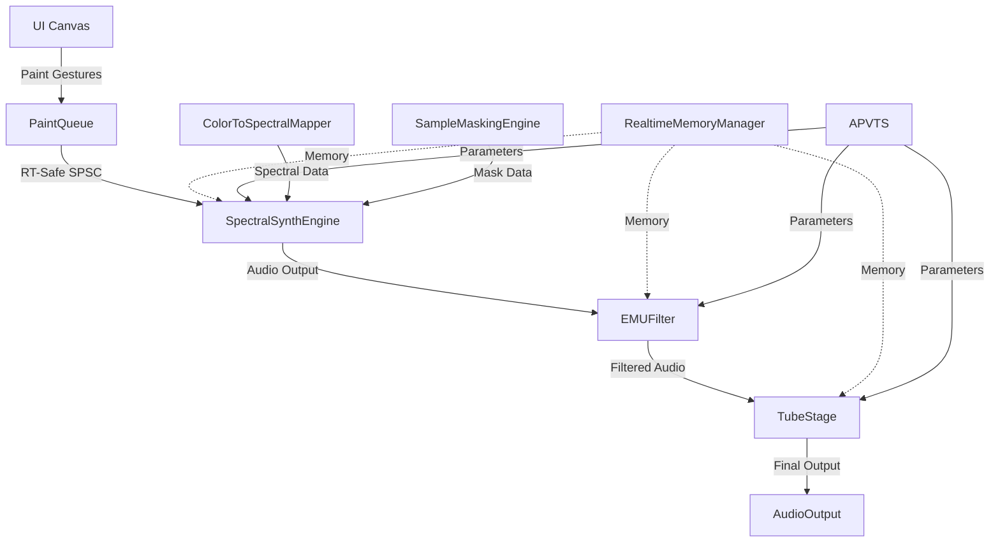

# SpectralCanvas Pro Brownfield Enhancement Architecture

## Introduction

This document outlines the architectural approach for enhancing SpectralCanvas Pro with systematic restoration of sophisticated audio processing components from archived codebase. Its primary goal is to serve as the guiding architectural blueprint for AI-driven development of restored features while ensuring seamless integration with the existing RT-safe foundation.

**Relationship to Existing Architecture:**
This document supplements existing project architecture by defining how archived sophisticated components will integrate with the current minimal but stable foundation. Where conflicts arise between archived and current patterns, this document provides guidance on maintaining RT-safety while implementing professional-grade enhancements.

### Existing Project Analysis

**Current Project State:**
- **Primary Purpose:** Professional VST3/Standalone audio plugin for spectral synthesis and paint-to-audio conversion
- **Current Tech Stack:** JUCE 7.0.12, C++17, CMake, MSVC 2022, Real-time audio processing
- **Architecture Style:** Real-time safe audio processing with lock-free SPSC queues, atomic parameter management
- **Deployment Method:** VST3 plugin + Standalone application with pluginval validation

**Available Documentation:**
- CLAUDE.md - RT-safety rules and development workflow
- BLUEPRINT_BROWNFIELD.md - Strategic recovery framework
- Session notes documenting restoration progress
- Agent contracts for specialized validation

**Identified Constraints:**
- Zero heap allocations in audio thread (processBlock chain)
- Zero locks/mutexes in real-time processing
- Zero logging/cout/DBG in audio processing
- SPSC queue pattern for UI→Audio communication
- JUCE 7.0.12 compatibility requirements
- Professional audio standards (sub-5ms latency)

## Enhancement Scope and Integration Strategy

**Enhancement Overview:**
- **Enhancement Type:** Systematic restoration of sophisticated archived components
- **Scope:** Professional audio processing features, advanced UI components, EMU-style filtering
- **Integration Impact:** High - Restoring 173+ archived files into 49-file foundation

**Integration Approach:**
- **Code Integration Strategy:** Incremental restoration with RT-safety validation at each step
- **Database Integration:** N/A - Audio plugin architecture uses memory pools and parameter trees
- **API Integration:** JUCE AudioProcessor API compliance with VST3 standards
- **UI Integration:** JUCE Component architecture with sophisticated LookAndFeel systems

**Compatibility Requirements:**
- **Existing API Compatibility:** Maintain JUCE AudioProcessor interface compliance
- **Database Schema Compatibility:** N/A - Parameter state management via APVTS
- **UI/UX Consistency:** Professional audio software standards with EMU-style aesthetics
- **Performance Impact:** Maintain <5ms paint-to-audio latency, zero RT violations

## Tech Stack Alignment

### Existing Technology Stack

| Category | Current Technology | Version | Usage in Enhancement | Notes |
|----------|-------------------|---------|---------------------|-------|
| Framework | JUCE | 7.0.12 | Core audio/GUI foundation | Maintained across all components |
| Language | C++ | 17 | All restored components | RT-safe patterns required |
| Build System | CMake | 3.22+ | Integration of archived sources | Source list expansion |
| Compiler | MSVC | 2022 | Windows optimization flags | Professional audio optimizations |
| Audio API | VST3/Standalone | Latest | Plugin format compliance | Industry standard |
| GUI System | JUCE Components | 7.0.12 | Professional UI restoration | LookAndFeel sophistication |
| Threading | std::atomic/SPSC | C++17 | RT-safe communication | Lock-free patterns only |
| Testing | CTest/Custom | Built-in | RT-safety validation | Zero-tolerance enforcement |

### New Technology Additions

No new external technologies required - all enhancements use existing JUCE/C++17 foundation.

## Data Models and Schema Changes

### New Data Models

#### **PaintGesture**
**Purpose:** Lock-free representation of UI paint strokes for audio synthesis
**Integration:** Flows through PaintQueue SPSC from UI to audio thread

**Key Attributes:**
- x, y: float - Normalized coordinates (0.0-1.0)
- pressure: float - Brush pressure (0.0-1.0)
- flags: uint32_t - Stroke state (start/move/end)
- timestamp: uint64_t - High-resolution timing

**Relationships:**
- **With Existing:** Consumed by SpectralSynthEngine for frequency/amplitude mapping
- **With New:** Processed by ColorToSpectralMapper and SampleMaskingEngine

#### **SpectralMask**
**Purpose:** Frequency-domain representation of painted canvas regions
**Integration:** Generated by paint gestures, consumed by spectral processors

**Key Attributes:**
- frequencyBins: std::vector<float> - FFT bin amplitudes
- phaseData: std::vector<float> - Phase information
- maskIntensity: float - Overall mask strength
- spatialPosition: Point<float> - Canvas coordinate mapping

**Relationships:**
- **With Existing:** Integrates with existing AtomicOscillator for synthesis
- **With New:** Processed by EMUFilter and SecretSauceEngine

### Schema Integration Strategy

**Database Changes Required:**
- **New Tables:** N/A - Audio plugin uses in-memory structures
- **Modified Tables:** N/A - Parameter state handled by APVTS
- **New Indexes:** N/A - Real-time access patterns use direct memory
- **Migration Strategy:** Component restoration with runtime validation

**Backward Compatibility:**
- Existing minimal foundation remains functional during restoration
- New components added incrementally with feature flags

## Component Architecture

### New Components

#### **PaintQueue** (Critical P1 Restoration)
**Responsibility:** Lock-free SPSC queue for UI→Audio thread communication
**Integration Points:** UI gesture capture → Audio synthesis pipeline

**Key Interfaces:**
- `forcePush(gesture)` - RT-safe producer interface
- `pop(gesture)` - RT-safe consumer interface

**Dependencies:**
- **Existing Components:** PluginProcessor audio thread
- **New Components:** None - fundamental infrastructure

**Technology Stack:** C++17 atomic operations, memory_order_relaxed optimization

#### **EMUFilter** (Professional P2 Restoration)
**Responsibility:** EMU SP-1200 style analog filter emulation
**Integration Points:** Post-spectral synthesis processing chain

**Key Interfaces:**
- `processBlock(buffer)` - RT-safe audio processing
- `setFilterParams(cutoff, resonance)` - Atomic parameter updates

**Dependencies:**
- **Existing Components:** SpectralSynthEngine output
- **New Components:** TubeStage, SecretSauceEngine

**Technology Stack:** JUCE DSP modules, custom analog modeling

#### **RealtimeMemoryManager** (Critical P1 Restoration)
**Responsibility:** RT-safe memory allocation for audio thread
**Integration Points:** All audio processing components requiring dynamic allocation

**Key Interfaces:**
- `allocate(size)` - RT-safe allocation
- `deallocate(ptr)` - RT-safe deallocation

**Dependencies:**
- **Existing Components:** All audio processors
- **New Components:** Advanced spectral processing engines

**Technology Stack:** Pre-allocated memory pools, lock-free allocation

### Component Interaction Diagram



## Source Tree Integration

### Existing Project Structure
```
SpectralCanvas/
├── Source/
│   ├── Core/                    # Existing foundation
│   │   ├── PluginProcessor.cpp  # Main processor
│   │   ├── Config.cpp          # Configuration
│   │   └── SpectralSynthEngine.cpp # Basic synthesis
│   ├── GUI/                     # Existing UI
│   │   ├── PluginEditor.cpp     # Main editor
│   │   └── PluginEditorMVP.cpp  # Minimal editor
│   └── Tests/                   # Existing tests
├── _archive/                    # Sophisticated components
│   └── ghost_code_cleanup_20250816_204913/
└── build/                       # Build artifacts
```

### New File Organization
```
SpectralCanvas/
├── Source/
│   ├── Core/                           # Enhanced core
│   │   ├── PaintQueue.h                # NEW: RT-safe UI→Audio queue
│   │   ├── RealtimeMemoryManager.h     # NEW: RT-safe allocation
│   │   ├── EMUFilter.cpp               # NEW: Analog filter emulation
│   │   ├── TubeStage.cpp               # NEW: Tube amp modeling
│   │   ├── SecretSauceEngine.cpp       # NEW: Proprietary processing
│   │   ├── SampleMaskingEngine.cpp     # NEW: Spectral masking
│   │   ├── MorphFilter.cpp             # NEW: Morphing filters
│   │   └── EMURomplerEngine.cpp        # NEW: Sampler engine
│   ├── GUI/                            # Enhanced UI
│   │   ├── Skin/                       # NEW: Professional skins
│   │   │   ├── EMUDesktopLookAndFeel.cpp # Professional appearance
│   │   │   └── SpectralLookAndFeel.cpp   # Spectral-specific UI
│   │   ├── PaintControlPanel.cpp       # NEW: Paint controls
│   │   └── ExportDialog.cpp            # NEW: Export functionality
│   ├── Tests/                          # Enhanced testing
│   │   ├── ThreadSafetyTests.cpp       # NEW: RT-safety validation
│   │   ├── TestEnginePreparedness.cpp  # NEW: Engine validation
│   │   └── EMUFilter_RedTests.cpp      # NEW: Filter testing
│   └── Util/                           # NEW: Utilities
│       └── Determinism.cpp             # NEW: Deterministic processing
```

### Integration Guidelines
- **File Naming:** Follow existing JUCE PascalCase conventions
- **Folder Organization:** Group by functional responsibility (Core/GUI/Tests/Util)
- **Import/Export Patterns:** Use JUCE module patterns with proper header guards

## Infrastructure and Deployment Integration

### Existing Infrastructure
**Current Deployment:** CMake build system generating VST3 + Standalone executables
**Infrastructure Tools:** MSVC compiler, CTest validation, pluginval testing
**Environments:** Development (local), Validation (pluginval), Distribution (signed binaries)

### Enhancement Deployment Strategy
**Deployment Approach:** Incremental component restoration with validation gates
**Infrastructure Changes:** Expanded CMake source lists, additional test targets
**Pipeline Integration:** Enhanced CTest suite with RT-safety validation

### Rollback Strategy
**Rollback Method:** Git branch management with component-level reversion
**Risk Mitigation:** Incremental restoration with validation at each step
**Monitoring:** RT-safety assertions, performance regression detection

## Coding Standards and Conventions

### Existing Standards Compliance
**Code Style:** JUCE conventions with PascalCase classes, camelCase methods
**Linting Rules:** MSVC /W4 warning level, RT-safety static analysis
**Testing Patterns:** CTest integration with RT-safety focused validation
**Documentation Style:** Inline comments for RT-safety critical sections

### Critical Integration Rules
- **Existing API Compatibility:** Maintain JUCE AudioProcessor interface compliance
- **Database Integration:** Use APVTS for parameter state, avoid direct state storage
- **Error Handling:** RT-safe error propagation without exceptions in audio thread
- **Logging Consistency:** Zero logging on audio thread, UI thread only for diagnostics

## Testing Strategy

### Integration with Existing Tests
**Existing Test Framework:** CTest with custom RT-safety validation
**Test Organization:** Component-specific test files with RT-safety focus
**Coverage Requirements:** 100% RT-safety compliance, functional validation

### New Testing Requirements

#### Unit Tests for New Components
- **Framework:** Custom RT-safety test harness
- **Location:** Source/Tests/ with component-specific files
- **Coverage Target:** 100% RT-safety validation, functional correctness
- **Integration with Existing:** Extends existing CTest configuration

#### Integration Tests
- **Scope:** Full paint-to-audio pipeline validation
- **Existing System Verification:** Maintain foundation functionality
- **New Feature Testing:** Sophisticated component interaction validation

#### Regression Testing
- **Existing Feature Verification:** Automated RT-safety regression suite
- **Automated Regression Suite:** CTest integration with performance baselines
- **Manual Testing Requirements:** Professional audio workflow validation

## Security Integration

### Existing Security Measures
**Authentication:** N/A - Desktop audio plugin
**Authorization:** N/A - Local processing only
**Data Protection:** Memory protection, secure state handling
**Security Tools:** Static analysis for buffer overflows, RT-safety validation

### Enhancement Security Requirements
**New Security Measures:** Enhanced memory safety for restored components
**Integration Points:** RT-safe memory management, secure parameter handling
**Compliance Requirements:** Professional audio industry standards

## Next Steps

### Implementation Priority

**Phase 1: Critical Infrastructure (Current Session)**
1. Restore PaintQueue.h for RT-safe UI→Audio communication
2. Integrate RealtimeMemoryManager for safe allocation
3. Validate ThreadSafetyTests for regression prevention
4. Enable basic professional LookAndFeel components

**Phase 2: Advanced Audio Processing**
1. Restore EMUFilter and TubeStage for analog modeling
2. Integrate SampleMaskingEngine for sophisticated spectral processing
3. Add SecretSauceEngine for proprietary audio enhancement
4. Validate full paint-to-audio pipeline

**Phase 3: Professional Features**
1. Complete UI sophistication with full EMUDesktopLookAndFeel
2. Add export/import functionality for professional workflows
3. Integrate hardware controller support
4. Optimize performance with SIMD acceleration

### Developer Handoff

**Key Technical Decisions:**
- RT-safety is non-negotiable - zero tolerance for violations
- Incremental restoration minimizes integration risk
- Component-level validation required at each step
- Professional audio standards maintained throughout

**Integration Requirements:**
- All restored components must pass RT-safety validation
- Existing foundation functionality must remain intact
- Performance regression detection required
- Professional appearance standards maintained

**Implementation Sequencing:**
1. Start with critical infrastructure (PaintQueue, RealtimeMemoryManager)
2. Add components incrementally with validation gates
3. Maintain RT-safety compliance at every step
4. Validate professional standards before component completion

---

**Architecture document complete. Ready for systematic restoration of SpectralCanvas Pro's sophisticated components using this brownfield enhancement framework.**